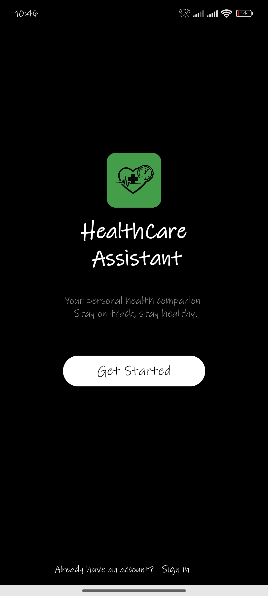
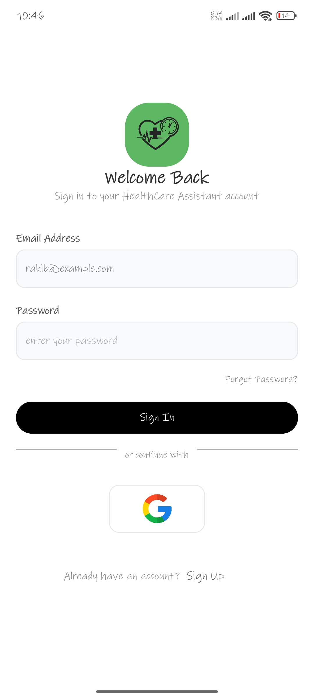
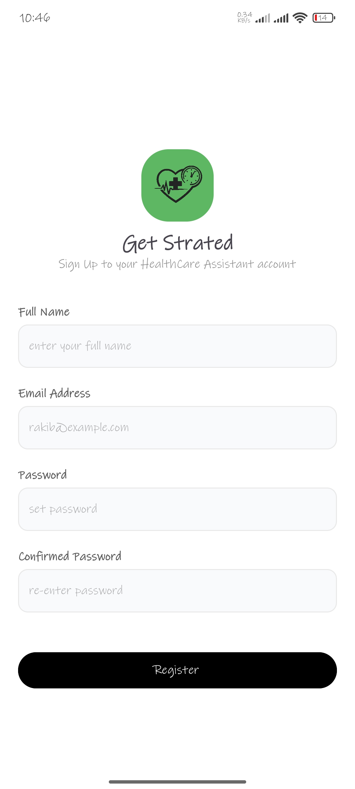
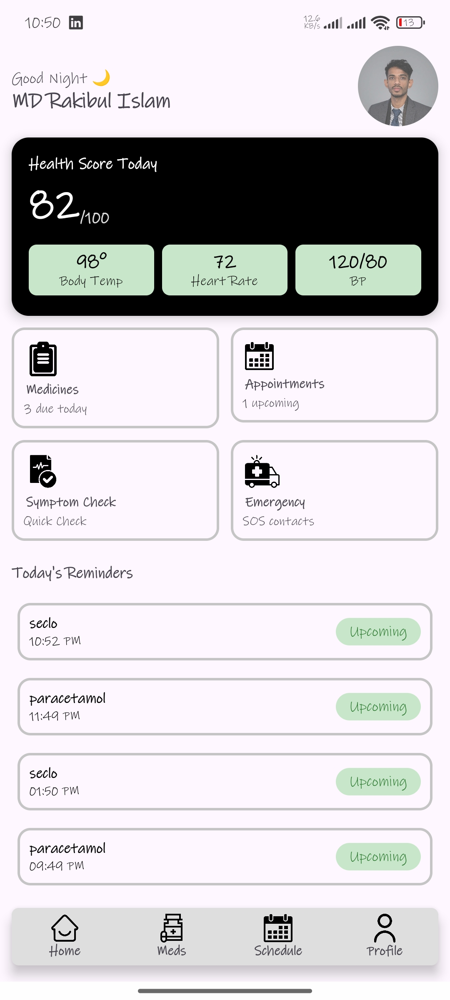
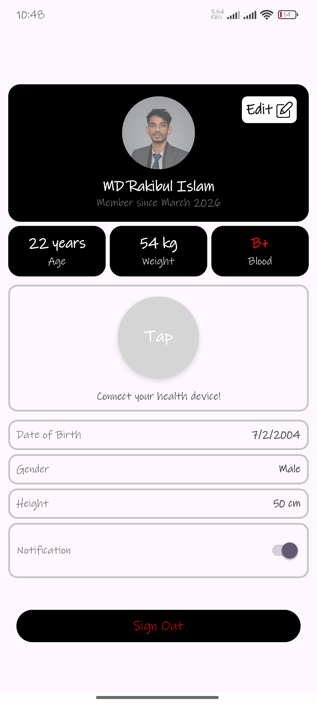
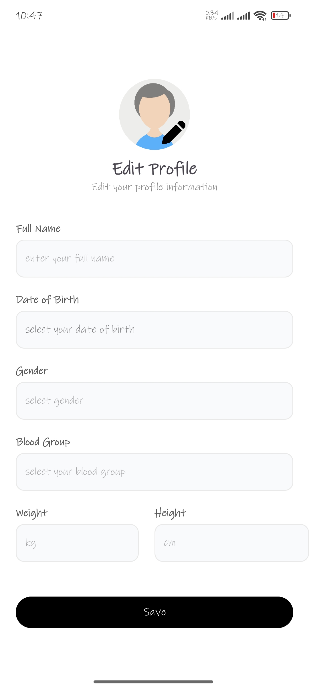
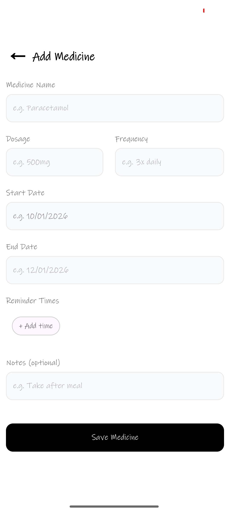
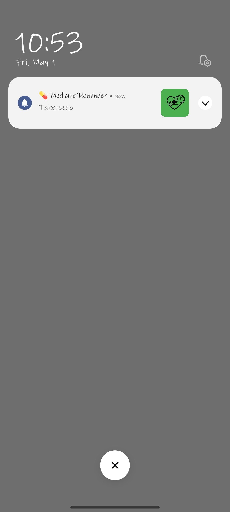

# Smart Health Care Assistant Android App (Ongoing).

Nowadays, people are very busy in their daily life and often forget to take medicine on time or miss doctor appointments. Also, many people do not keep proper track of their health information. Because of this, small health issues can become serious problems. To solve this issue, I want to develop a Smart Health Care Assistant App for Android devices. This app will help users manage their daily health activities in an easy and organized way. It will work as a personal health assistant where users can store their basic health information, set medicine reminders, and manage doctor appointments. The main goal of this application is to make healthcare management simple, smart, and accessible for everyone.

## The application will include the following features:
1. User Profile: Users will be able to create and manage their profile by adding information like name, age, weight, and blood group.
2. Medicine Reminder: Users can add their medicines with time and dosage. The app will send notifications to remind them to take medicine on time.
3. Appointment Scheduler: Users can set doctor appointments and get reminders before the scheduled time.
4. Symptom Checker: Users can enter basic symptoms, and the app will provide simple suggestions based on predefined conditions.
5. Health Tips: The app will show daily health tips to encourage users to stay healthy.
6. Emergency Contact: Users can save emergency contact numbers and quickly call them when needed.

## The following tools and technologies will be used:
- Programming Language: Java.
- Development Environment: Android Studio.
- Database: Firebase Firestore / Realtime Database
- Authentication: Firebase Authentication.
- UI Design: XMLLayout.
- Notification System: AlarmManager / Notification Manager
- Documentation: LaTeX.
- Version Control: Git and GitHub.

## User Interface
|  |  |
|---|---|
| 1. Splash View Group    | 2. Login View Group    |
| 3. Sign Up View Group    | 4. Main View Group    |
| 5. Profile View Group    | 6. Edit Profile View Group    |
| 7. Add Medicine View Group    | 8.  Notification    |

## Creator
**Md Rakibul Islam**  
BSc in Computer Science & Engineering  

